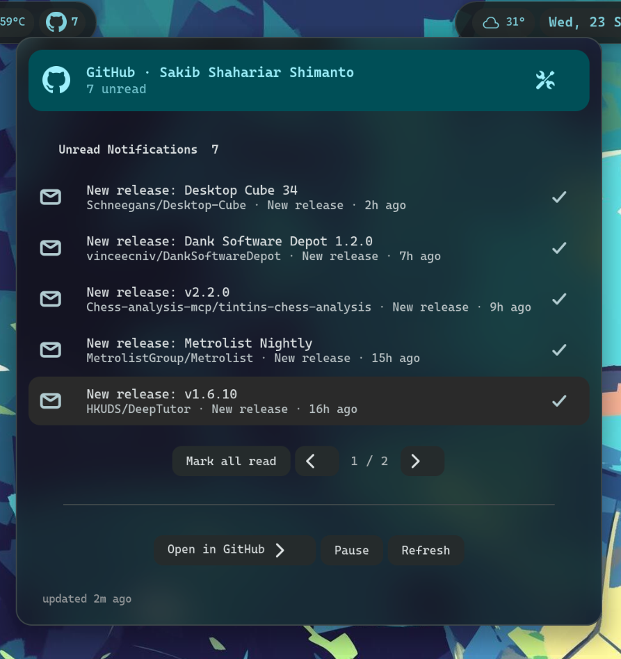

# GitHub Notifier

> Mentions, reviews, issues/PRs and stars — in your top panel.


A GNOME Shell extension that watches the GitHub API and keeps your notifications in the panel: a live mirror of your unread inbox, plus new issues/PRs and stars on repos you care about — without opening a browser.

## Screenshot



## Features

| | |
|---|---|
| 💬 **Inbox** | Full unread GitHub notifications (live mirror of `/notifications`, not a local diff) |
| 📝 **Watch** | New issues/PRs on chosen repos |
| ⭐ **Stars** | New stars count |
| 🔔 **Toasts** | `Open` / `Mark read` + grouped by repo |

Inbox uses `participating=false`, so you see the same unread list as github.com/notifications (mentions, review requests, subscribed threads, etc.).

`Mark all as read` clears locally + `PUT /notifications {last_read_at}` on GitHub. Pause from menu; `Hide when empty` keeps the icon hidden unless there's an error.

## Requirements

* GNOME Shell 45–51
* A GitHub **access token** (see [Configure](#configure)) — the extension needs it for all API calls
* A **full internet** connection (the extension pauses on portal/LOCAL connectivity to avoid timeout storms)

## Install

```bash
cp -r github-notifier@local ~/.local/share/gnome-shell/extensions/
glib-compile-schemas ~/.local/share/gnome-shell/extensions/github-notifier@local/schemas/
# X11: Alt+F2 → r | Wayland: logout
gnome-extensions enable github-notifier@local
```

Prefs: panel → `Settings…` or `gnome-extensions prefs github-notifier@local`

## Configure

| Setting | Notes |
|---|---|
| **Token** | `github.com/settings/tokens` — Classic `notifications`+`repo`, or fine-grained Issues/PRs + Metadata |
| **Username** | your GitHub handle |
| **API host** | `api.github.com` or `github.example.com` (GHES → `/api/v3`) |
| **Repos** | `owner/repo, owner/repo` — banner if empty while watches on |
| **Poll** | 30–3600s, default 120s |

Sections: **Account** / **Watching** / **Settings**

## How it works

* Polls `/notifications`, `/repos/{repo}/issues` (page 2 verified when 20 new), `/repos/{repo}` stars.
* Baseline `now tracking` toast on first poll.
* `150` notifs cap → `More than shown` sentinel; `!` stays visible on 401/403.

<details>
<summary>Notes</summary>

* Icon `icons/github-symbolic.svg` — `fill=currentColor`, recolors with theme. GitHub mark is trademark.
* Token is stored plain in `dconf` (GSettings). Prefer a **fine-grained, read-only** PAT with only the scopes you need; revoke if the machine is shared or compromised.
* Rate limit 5000/hr authenticated (shared across all clients using the token).
* API host may be `api.github.com` or a GHES host; web links follow the same host via `_webBase()`.
</details>

## Troubleshooting

* Shell errors/logs: `journalctl -f /usr/bin/gnome-shell`
* Interactive debug console (X11): press **Alt+F2** and enter `lg`
* Not seeing anything? Make sure the token is valid, the repo names are `owner/repo` format, and the network is on a FULL connection.

## Uninstall

```bash
gnome-extensions disable github-notifier@local
rm -rf ~/.local/share/gnome-shell/extensions/github-notifier@local
dconf reset -f /org/gnome/shell/extensions/github-notifier/
```

## Feedback

Bugs, ideas, or PRs are welcome at [github.com/SakibShahariar/github-notifier](https://github.com/SakibShahariar/github-notifier).